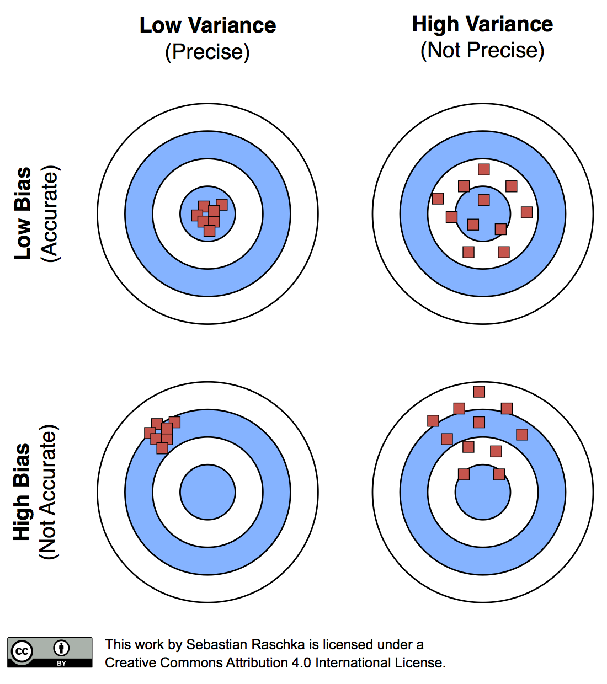
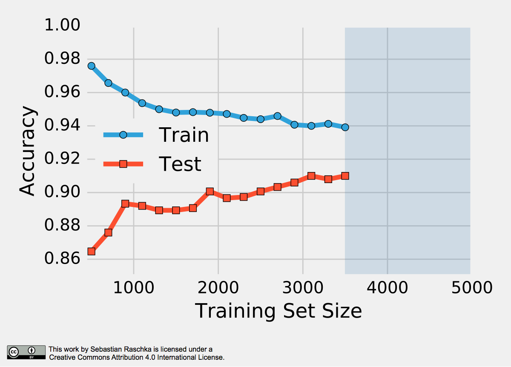
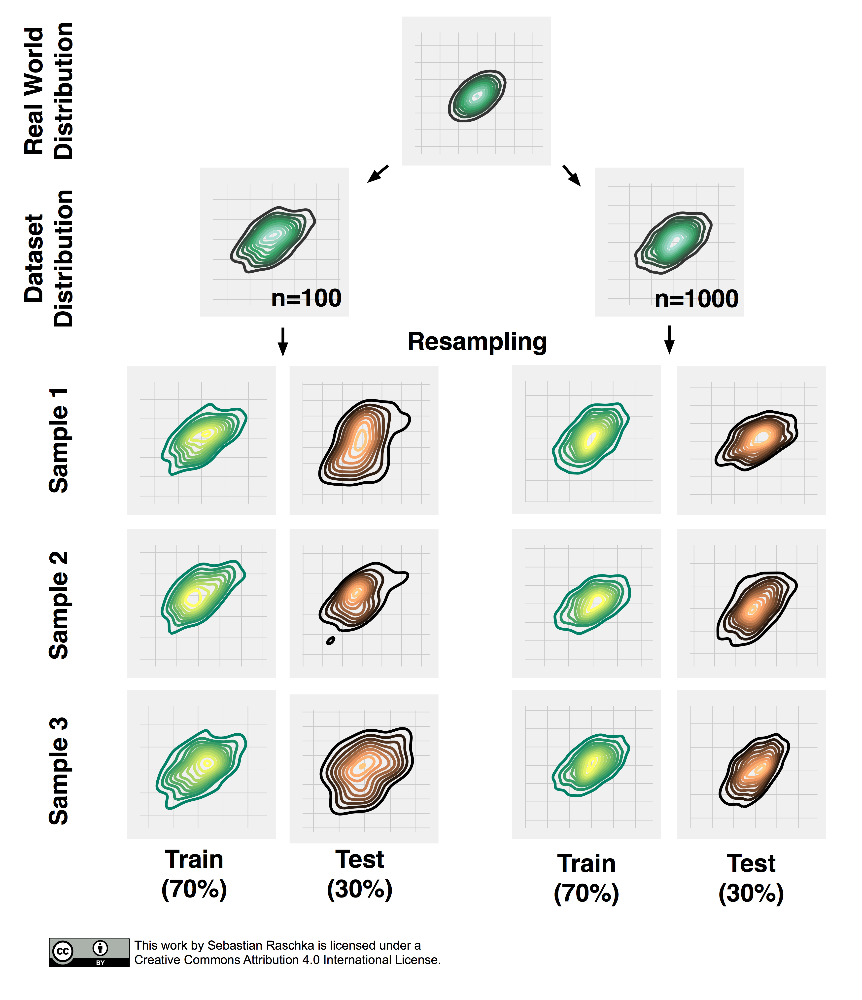
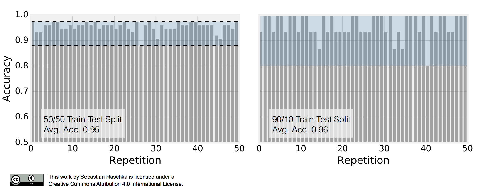
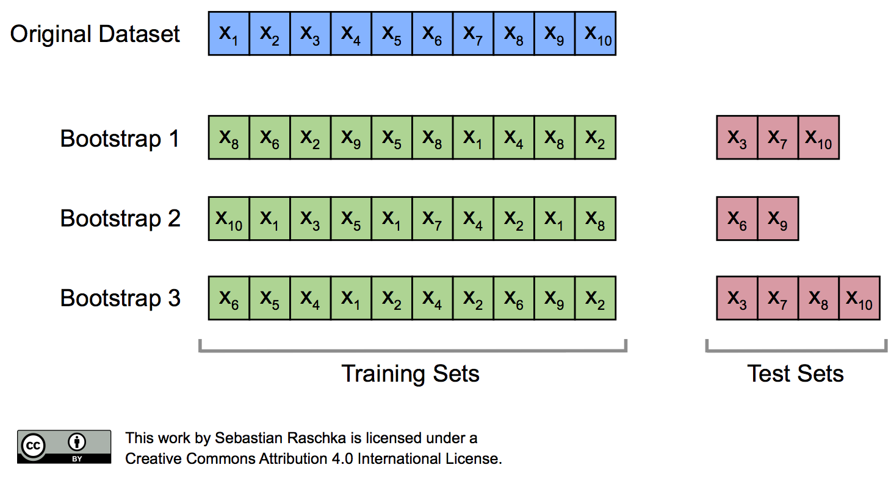
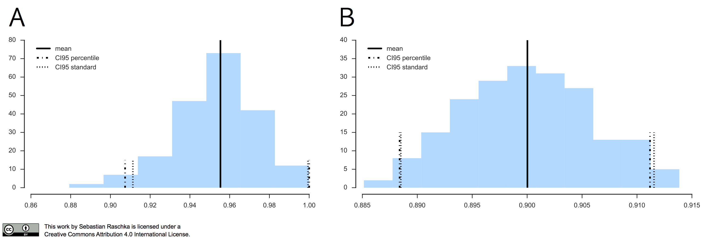
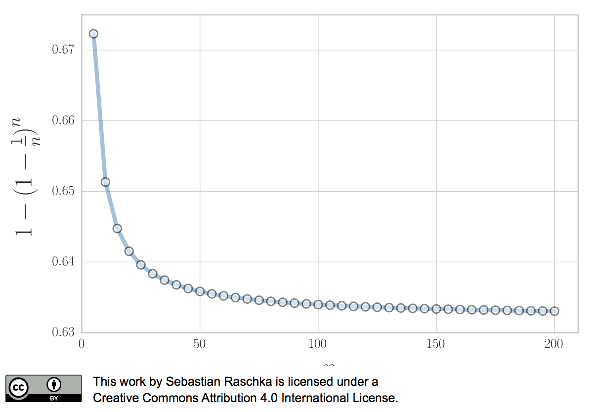

# Model evaluation, model selection, and algorithm selection in machine learning - Part II

*This article was published at http://sebastianraschka.com/blog/2016/model-evaluation-selection-part2.html*

## Introduction

In the previous article ([Part I](http://sebastianraschka.com/blog/2016/model-evaluation-selection-part1.html)), we introduced the general ideas behind model evaluation in supervised machine learning. We discussed the holdout method, which helps us to deal with real world limitations such as limited access to new, *labeled* data for model evaluation. Using the holdout method, we split our dataset into two parts: A training and a test set. First, we provide the training data to a supervised learning algorithm. The learning algorithm builds a model from the training set of labeled observations. Then, we evaluate the predictive performance of the model on an independent test set that shall represent new, unseen data. Also, we briefly introduced  the *normal approximation*, where we make certain assumptions that allow us to compute confidence intervals for modeling the uncertainty of our performance estimate based on a single test set, which we have to take with a grain of salt.

In this article, we will look at some advanced techniques for model evaluation. We will start by discussing techniques for estimating the uncertainty of our estimated model performance as well as the model's variance and stability. And after getting these basics under our belt, we will look at cross-validation techniques for model selection in the next article in this series. As we remember from part I, there are three related, yet different tasks or reasons why we care about model evaluation:

1. We want to estimate the generalization accuracy, the predictive performance of our model on future (unseen) data.
2. We want to increase the predictive performance by tweaking the learning algorithm and selecting the best-performing model from a given hypothesis space.
3. We want to identify the machine learning algorithm that is best-suited for the problem at hand; thus, we want to compare different algorithms, selecting the best-performing one as well as the best-performing model from the algorithm’s hypothesis space.

(The code for producing the plots shown in this article can be found in the Jupyter notebook on [GitHub](https://github.com/rowennetfinder555/Classification/blob/master/data_viz/model-evaluation-articles/model-eval-kfold.ipynb)).

## Resampling

In the [first part](http://sebastianraschka.com/blog/2016/model-evaluation-selection-part1.html) in this series, we talked about the prediction accuracy or error of classification models. To compute the classification error or accuracy on a dataset *S*, we defined the following equation

$$
\text{ERR}_S = \frac{1}{n} \sum_{i=1}^{n} L\big(\hat{y}_i, y_i \big) = 1 - \text{ACC}_S.
$$

Here, $$L(\cdot)$$ represents the 0-1 loss, which we compute from the predicted class labels $$\hat{y}_i$$ and the true labels $$y_i$$ over all *n* samples in a dataset *S*:

$$
L(\hat{y_i}, y_i) :=
\begin{cases}
0 &\text{if } \hat{y_i} = y_i \\\\
1 &\text{if } \hat{y_i} \neq y_i.
\end{cases}
$$

In essence, the classification error is simply the count of incorrect predictions divided by the number of samples in the dataset. Vice versa, we compute the prediction accuracy as the number of correct predictions divided by the number of samples.

Note that the concepts presented in this article do also apply to other types of supervised learning, such as regression analysis. To use the resampling methods presented in the following sections, we simply need to swap the accuracy or error computation using the prediction accuracy or error by the mean squared error (MSE):

$$
MSE_S = \frac{1}{n} \sum_{i=1}^{n}  ( \hat{y}_i - y_i)^2.
$$

As we learned in [part I](http://sebastianraschka.com/blog/2016/model-evaluation-selection-part1.html), our performance estimates may suffer from bias and variance, and we are interested in finding a good tradeoff. For instance, the resubstitution evaluation (fitting a model to a training set and using the same training set for model evaluation) is heavily optimistically biased. Vice versa, withholding a large portion of the dataset as a test set may lead to pessimistically biased estimates. While reducing the size of the test set may decrease this pessimistic bias, the variance of our performance estimates will most likely increase. In this article, we will look at alternative resampling methods for finding a good balance between bias and variance in model evaluation and selection.

{: .center-image  .image-60 }

The reason why a proportionally large test sets increase the pessimistic bias is that the model may not have reached its full capacity, yet. In other words, the learning algorithm could have formulated a more powerful, generalizable hypothesis for classification if it had seen more data. To demonstrate this effect, I plotted learning curves of [Softmax classifiers](http://rasbt.github.io/mlxtend/user_guide/tf_classifier/TfSoftmaxRegression/), which I fitted to small subsets of [MNIST](http://yann.lecun.com/exdb/mnist/):

{: .center-image  .image-80 }

To produce the plot above, I took 500 random samples of each of the ten classes from MNIST &mdash; instances of the handwritten digits 0 to 9. The 5000-sample MNIST subset was then randomly divided into a 3500-sample training subset and a test set containing 1500 samples while keeping the class proportions intact via stratification. Finally, even smaller subsets of the 3500-sample training set were produced via randomized, stratified splits, and I used these subsets to fit softmax classifiers and used the same 1500-sample test set to evaluate their performances; samples may overlap between these training subsets. Looking at the plot above, we can see two distinct trends. First, the resubstitution accuracy (training set) declines as the number of training samples shrinks. Second, we observe an improving generalization accuracy (test set) with an increasing training set size. These trends can likely be attributed to a reduction in overfitting. If the training set is small, the algorithm is more likely picking up noise in the training set so that the model fails to generalize well to data that it hasn't seen before. This observation also explains the pessimistic bias of the holdout method: A training algorithm may benefit from more training data, data that we withheld for testing. Thus, after we evaluated a model, we want to run the learning algorithm once again on the complete dataset before we use it in a real-world application.

Now, that we established the point of pessimistic biases for disproportionally large test sets, we may ask whether or not it is a good idea to decrease the size of the test set. Decreasing the size of the test set brings up another problem: It may result in a substantial variance of our model's performance estimate. The reason is that it depends on which instances end up in training set, and which particular instances end up in test set. Keeping in mind that each time we resample our data, we alter the statistics of the distribution of the sample. Most supervised learning algorithms for classification and regression as well as our performance estimates operate under the assumption that our dataset is representative of the population that this dataset sample has been drawn from. As we learned in [part I](http://sebastianraschka.com/blog/2016/model-evaluation-selection-part1.html), stratification helps with keeping the sample proportions intact upon splitting a dataset. However, the change in the underlying sample statistics along the features axes is still a problem that becomes more pronounced if we work with small datasets, which is illustrated in the figure below, where I repeatedly subsampled a two-dimensional Gaussian.

## Repeated Holdout Validation

One way to obtain a more robust performance estimate that is less variant to how we split the data into training and test sets is to repeat the holdout method *k* times with different random seeds and compute the average performance over these *k* repetitions

$$\text{ACC}_{avg} = \frac{1}{k} \sum^{k}_{j=1} {ACC_j},$$

where $$\text{ACC}_j$$ is the accuracy estimate of the *j*th test set of size *m*,

$$\text{ACC}_j = 1 - \frac{1}{m} \sum_{i=1}^{m} L\big(\hat{y}_i, y_i \big). $$

This repeated holdout procedure, sometimes also called *Monte Carlo Cross-Validation*, provides with a better estimate of how well our model may perform on a random test set, and it can also give us an idea about our model's stability &mdash; how the model produced by a learning algorithm changes with different training set splits. The following figure shall demonstrate how repeated holdout validation may look like for different training-test split using the [Iris](https://archive.ics.uci.edu/ml/datasets/Iris) dataset to fit to 3-nearest neighbors classifiers.

To produce the subplot on the left, I performed 50 stratified training/test splits with 75 samples in the test and training set each; a K-nearest neighbors model was fit to the training set and evaluated on the test set in each repetition. The average accuracy of these 50 50/50 splits was 95%. I followed the same procedure to produce the left subplot. Here, I repeatedly performed 90/10 splits, though, so that the test set consisted of only 15 samples. This time, the average accuracy over these 50 splits was 96%. Back to the plot above: It really demonstrates two of the points that we previously discussed. First, we see that the variance of our estimate increases as the size of the test set decreases. Second, we see a small increase in the pessimistic bias when we decrease the size of the training set &mdash; we withhold more training data in the 50/50 split, which may be the reason why the average performance over the 50 splits is slightly lower compared to the 90/10 splits.

In the next section, we look at an alternative method for evaluating a model's performance; we will talk about different flavors of the bootstrap method that are commonly used to infer the uncertainty of a performance estimate.

## The Bootstrap Method and Empirical Confidence Intervals

The previous examples of Monte Carlo Cross-Validation may have convinced us that repeated holdout validation could provide us with a more robust estimate of a model's performance on random test sets compared to an evaluation based on a single train/test split. In addition, the repeated holdout may give us an idea about the stability of our model. In this section, we will explore an alternative approach to model evaluation and calculate its uncertainty using the bootstrap method.

Let's assume that we'd like to compute a confidence interval around our performance estimate to judge it's certainty &mdash; or uncertainty. How can we achieve this if our sample has been drawn from an unknown distribution? Maybe we could use the sample mean as a point estimate of the population mean, but how would we compute the variance or confidence intervals around the mean if its distribution is unknown? Sure, we could collect multiple, independent samples; this is a luxury we often don't have in real world applications, though. Now, the idea behind the bootstrap is to generate "new samples" by sampling from an empirical distribution. As a side note, the term "bootstrap" likely originated from the phrase "to pull oneself up by one's bootstraps:"

> Circa 1900, to pull (oneself) up by (one's) bootstraps was used figuratively of an impossible task (Among the "practical questions" at the end of chapter one of Steele's "Popular Physics" schoolbook (1888) is, "30. Why can not a man lift himself by pulling up on his boot-straps?"). By 1916 its meaning expanded to include "better oneself by rigorous, unaided effort." The meaning "fixed sequence of instructions to load the operating system of a computer" (1953) is from the notion of the first-loaded program pulling itself, and the rest, up by the bootstrap.

(Source: [Online Etymology Dictionary](http://www.etymonline.com/index.php?allowed_in_frame=0&search=bootstrap))

The bootstrap method is a resampling technique for estimating a sampling distribution, and in the context of this article, we are particularly interested in estimating the uncertainty of our performance estimate &mdash; the prediction accuracy or error. The bootstrap method was introduced by Bradley Efron in 1979 (Efron, 1979). About 15 years later, Bradley Efron and Robert Tibshirani even devoted a whole book to the bootstrap, "An Introduction to the Bootstrap" (Efron and Tibshirani, 1994), which I recommend you to read if you are interested in more details on this topic. In brief, the idea of the bootstrap method is to generate *new* data from a population by repeated sampling from the original dataset *with replacement* &mdash; in contrast, the repeated holdout method can be understood as sampling *without* replacement. Walking through it step by step, the bootstrap method works like this:

1. We are given a dataset of size *n*.
2. For *b* bootstrap rounds:
	1. We draw one single instance from this dataset and assign it to our *j*th bootstrap sample. We repeat this step until our bootstrap sample has size *n* &mdash; the size of the original dataset. Each time, we draw samples from the same original dataset so that certain samples may appear more than once in our bootstrap sample and some not at all.
3. We fit a model to each of the *b* bootstrap samples and compute the resubstitution accuracy.
4. We compute the model accuracy as the average over the *b* accuracy estimates

$$ \text{ACC}_{boot} = \frac{1}{b} \sum_{j=1}^b \frac{1}{n} \sum_{i=1}^{n} \bigg( 1 - L\big(\hat{y}_i, y_i \big) \bigg).$$

As we discussed previously, the resubstitution accuracy usually leads to an extremely optimistic bias, since a model can be overly sensible to noise in a dataset. Originally, the bootstrap method aims to determine the statistical properties of an estimator when the underlying distribution was unknown and additional samples are not available. So, in order to exploit this method for the evaluation of predictive models, such as hypotheses for classification and regression, we may prefer a slightly different approach to bootstrapping using the so-called *Leave-One-Out Bootstrap* (LOOB) technique. Here, we use *out-of-bag* samples as test sets for evaluation instead of evaluating the model on the training data. Out-of-bag samples are the unique sets of instances that are not used for model fitting as shown in the figure below.

The figure above illustrates how three random bootstrap samples drawn from an exemplary ten-sample dataset ($$X_1, X_2, \dots X_{10}$$) and their out-of-bag sample for testing may look like. In practice, Bradley Efron and Robert Tibshirani recommend drawing 50 to 200 bootstrap samples as being sufficient for reliable estimates (Efron and Tibshirani, 1993).

To take a step back, assuming we have a sample that has been drawn from a normal distribution $$N(\mu, \sigma^2)$$ with unknown mean $$\mu$$ and variance $$\sigma^2$$. It's probably been a while since we took Statistics I, but if there's one thing we surely remember, it's that we could use the sample mean $$\bar{x}$$ as a point estimate of $$\mu$$,

$$\bar{x} = \frac{1}{n} \sum_{i=1}^{n} x_i,$$

and we could estimate the variance $$\sigma^2$$ as

$$\text{VAR} = \frac{1}{n-1} \sum_{i=1}^{n} (x_i - \bar{x})^2. $$

Hence, we compute the standard deviation as $$\text{SD} = \sqrt{\text{VAR}},$$
and we compute the standard error as

$$\text{SE} = \frac{\text{SD}}{\sqrt{n}}.$$

Using the standard error we can then compute a 95% confidence interval of the mean according to

$$\bar{x} \pm z \times \frac{\sigma}{\sqrt{n}}, $$

so that

$$\bar{x} \pm t \times \text{SE} $$

with z=1.96 for the 95% confidence interval. Since we estimate SD from the sample, we would have to consult a t-table to look up the actual value of *t*, which depends on the size of the sample &mdash; or the *degrees of freedom* to be precise. For instance, given a sample with n=100, we find that  $$t_{95} = 1.984 $$.

Similarly, we can compute the 95% confidence interval of the bootstrap estimate as

$$\text{ACC}_{boot} = \frac{1}{b} \sum_{i=1}^{b} \text{ACC}_i $$

and use it to compute the standard error

$$\text{SE}_{boot} = \sqrt{ \frac{1}{b-1} \sum_{i=1}^{b} (\text{ACC}_i - \text{ACC}_{boot})^2 }.$$

Finally, we can then compute the confidence interval around the mean estimate as

$$\text{ACC}_{boot} \pm t \times \text{SE}_{boot}.$$

Although the approach we outlined above seems intuitive, what can we do if our samples do *not* follow a normal distribution? A more robust, yet computationally straight-forward approach is the percentile method as described by B. Efron (Efron, 1981). Here, we pick our lower and upper confidence bounds as follows:

- $$\text{ACC}_{lower} = \alpha_{1}th$$ percentile of the $$\text{ACC}_\text{boot}$$ distribution
- $$\text{ACC}_{upper} = \alpha_{2}th$$ percentile of the $$\text{ACC}_{boot}$$ distribution,

where $$\alpha_1 = \alpha$$ and $$\alpha_2 = 1 - \alpha$$, and $$\alpha$$ is our degree of confidence to compute the $$100 \times (1 - 2 \times \alpha)$$ confidence interval. For instance, to compute a 95% confidence interval, we pick $$\alpha = 0.025$$ to obtain the 2.5th and 97.5th percentiles of the *b* bootstrap samples distribution as our upper and lower confidence bounds.

In practice, if our data is indeed (roughly) following a normal distribution, the "standard" confidence interval and percentile method typically agree as illustrated in the figure below.

In the left subplot, I applied the *Leave-One-Out Bootstrap* technique to evaluate 3-nearest neighbors models on Iris, and the right subplot shows the results of the same model evaluation approach on MNIST, using the same softmax algorithm that we discussed earlier.

In 1983, Bradley Efron described the *.632 Estimate*, a further improvement to address the pessimistic bias of the bootstrap cross-validation approach described above (Efron, 1983). The pessimistic bias in the "classic" bootstrap method can be attributed to the fact that the bootstrap samples only contain approximately 63.2% of the unique samples from the original dataset. For instance, we can compute the probability that a given sample from a dataset of size *n* is *not* drawn as a bootstrap sample as

$$P (\text{not chosen}) =  \bigg(1 - \frac{1}{n}\bigg)^n,$$

which is asymptotically equivalent to $$\frac{1}{e} \approx 0.368$$ as $$ n \rightarrow \infty. $$

Vice versa, we can then compute the probability that a sample *is* chosen as

$$P (\text{chosen}) = 1 - \bigg(1 - \frac{1}{n}\bigg)^n \approx 0.632$$

for reasonably large datasets, so that we'd select approximately $$0.632 \times n$$ uniques samples as bootstrap training sets and reserve $$ 0.368 \times n $$ out-of-bag samples for testing in each iteration.

{: .center-image  .image-80 }

Now, to address the bias that is due to this the sampling with replacement, Bradley Efron proposed the *.632 Estimate* that we mentioned earlier, which is computed via the following equation:

$$\text{ACC}_{boot} = \frac{1}{b} \sum_{i=1}^b \big(0.632 \cdot \text{ACC}_{h, i} + 0.368 \cdot \text{ACC}_{r, i}\big), $$

where $$\text{ACC}_{r, i}$$ is the resubstitution accuracy, and $$\text{ACC}_{h, i}$$ is the accuracy on the out-of-bag sample.

Now, while the *.632 Boostrap* attempts to address the pessimistic bias of the estimate, an optimistic bias may occur with models that tend to overfit so that Bradley Efron and Robert Tibshirani proposed the *The .632+ Bootstrap Method* (Efron and Tibshirani, 1997). Instead of using a fixed "weight" $$\omega = 0.632 $$ in

$$ACC_{\text{boot}} = \frac{1}{b} \sum_{i=1}^b \big(\omega \cdot \text{ACC}_{h, i} + (1-\omega) \cdot \text{ACC}_{r, i} \big), $$

$$\omega$$ is based on the "*no-information error rate*," which we compute by fitting a model to a dataset that contains all possible combinations between samples $$x_{i '}$$ and target class labels $$y_i$$ &mdash; we pretend that the observations and class labels are independent. For instance, we compute the *no-information error rate* $$\gamma $$ as follows:

$$\gamma = \frac{1}{n^2} \sum_{i=1}^{n} \sum_{i '=1}^{n} L(y_{i}, f(x_{i '})), $$

where $$f(\cdot)$$ is the hypothesis or classification rule and $$f(x_{i'})$$ to predict a class label $$\hat{y}_{i'}$$.

Then, we define $$\omega$$ as

$$ \omega = \frac{0.632}{1 - 0.368 \times R},$$

where *R* is the *relative overfitting rate*

$$R = \frac{(-1) \times (\text{ACC}_{h, i} - \text{ACC}_{r, i})}{\gamma - (1 -\text{ACC}_{h, i})}.$$

## What’s Next

In this article, we continued the discussion around biases and variances in evaluating machine learning models in more detail. We, talked about the repeated hold-out method that may provide us with some further insights into a model's stability. Then, we looked at the bootstrap method; a technique borrowed from the field of statistics. We explored different flavors of this bootstrap method that help us estimate the uncertainty of our performance estimates. After covering the basics of model evaluation in part I and II, we will tackle more interesting tasks concerning hyperparameter tuning and model selection in the upcoming parts III and IV.   

## References

- Efron, Bradley. 1979. "Bootstrap Methods: Another Look at the Jackknife." *The Annals of Statistics* 7 (1). Institute of Mathematical Statistics: 1–26. doi:10.1214/aos/1176344552.
- Efron, Bradley. 1981. "Nonparametric Standard Errors and Confidence Intervals." *Canadian Journal of Statistics* 9 (2). Wiley‐Blackwell: 139–58. doi:10.2307/3314608.
- Efron, Bradley. 1983. "Estimating the Error Rate of a Prediction Rule: Improvement on Cross-Validation." *Journal of the American Statistical Association* 78 (382): 316. doi:10.2307/2288636.
- Efron, Bradley, and Robert Tibshirani. 1994. *An Introduction to the Bootstrap*. Chapman & Hall.
- Efron, Bradley, and Robert Tibshirani. 1997. "Improvements on Cross-Validation: The .632+ Bootstrap Method." *Journal of the American Statistical Association* 92 (438): 548. doi:10.2307/2965703.
